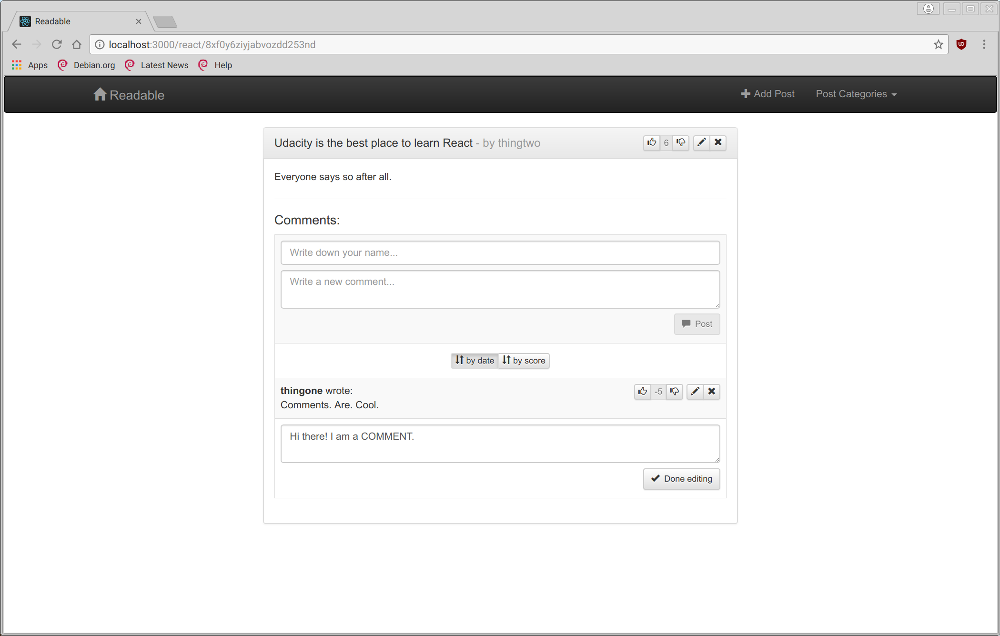
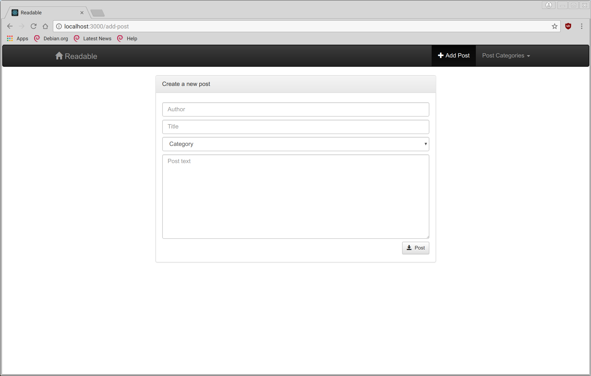

Readable
========

Readable is the second graded project developed in the Udacity's React
Nanodegree.

Installation
------------

You need to install all the dependencies of the project before trying to run it:

    npm install

It requires [this API server](https://github.com/udacity/reactnd-project-readable-starter.git)
to work. It's been developed against commit `ceeb69e`.

Launching
---------

After installing the dependencies you can start the node server:

    npm start

and navigate to [http://localhost:3000](http://localhost:3000).

Screenshots
-----------

List of all posts:

A post in view mode:

A post in edit mode:

One of the comments in edit mode:

Post creation form:

